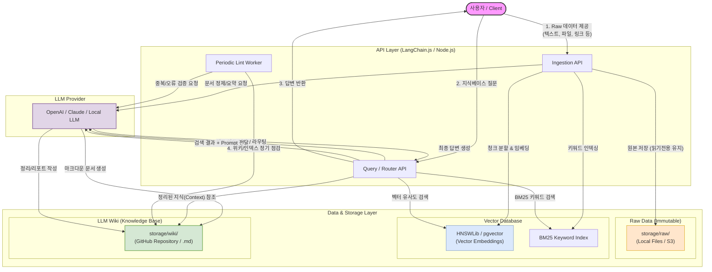

# mnemosyne

## 아키텍처



## 디렉토리 구조

```
mnemosyne/
├── storage/                    # 데이터 저장소 (로컬 또는 추후 S3/Git으로 오프로드)
│   ├── raw/                    # [Immutable] 사용자가 업로드한 수정을 금지하는 원본 데이터 (텍스트, 파일 등)
│   ├── wiki/                   # [LLM Wiki] LLM이 원본을 정제/요약하여 생성한 마크다운(.md) 지식 문서들
│   └── vector_store/           # [Vector DB] 마크다운 청크들을 임베딩(Vector)하여 저장한 로컬 파일 DB
├── src/                        # [API Layer] 전체 시스템의 데이터 흐름과 오케스트레이션을 담당하는 백엔드 로직
│   ├── ingest.ts               # [Ingest API] Raw 데이터를 받아 LLM Wiki 문서를 생성하고 Vector DB에 저장하는 비즈니스 로직
│   └── query.ts                # [Query/RAG API] 사용자 질문을 받아 Vector DB/Wiki를 검색하고 LLM 응답을 조율하는 라우팅 로직
├── .env                        # [Config] OPENAI_API_KEY 등 보안이 필요한 환경변수 설정 파일
├── package.json                # [Dependencies] 프로젝트 메타데이터 및 의존성 라이브러리 관리 파일
└── tsconfig.json               # [TS Config] TypeScript 컴파일러 옵션 및 빌드 동작 설정 파일
```

## 요구사항 명세서

### 최소 요구사항

- 사용자는 지식베이스와 관련된 여러가지 raw 데이터 - 이미지 동영상 링크, 그 외 파일, 텍스트 등을 제공한다.
- 이런 데이터들을 받아서 llm wiki(github 저장소) 및 RAG 기반의 벡터 데이터베이스에 저장을 한다 (각각 ingest, embed 작업을 진행한다)
- 나중에 사용자가 해당 지식베이스에 대해서 질문을 하면 API 레이어에서 wiki,
  RAG(BM25 키워드 검색 + 벡터 기반 검색) 을 수행하여 결과를 제공한다.
- 사용자가 제공한 raw 데이터는 절대 불변 상태를 유지해야 한다.
- 스스로 정기적으로 lint하고 보고할수 있다면 더더욱 좋을거 같다.

#### 최소 요구사항을 위해 필요한 인프라와 기술 스택

##### 인프라

- 별도의 또다른 깃허브 저장소: llm wiki 구축을 위해 필요
- s3: 사용자가 제공하는 raw 데이터를 저장하는 곳
  (일단 초반에는 지금 로컬 개발 환경의 파일시스템에서 테스트해보는 걸로.
  S3는 접근을 어떻게 해야할지, 그리고 프리티어 얼마나 사용할수있는지 알아봐야 한다)
- postgreSQL: 벡터 DB 역할을 해준다? 아직 잘 모르겠음
- llm: 어떤 모델을 사용할 건지 정해야 함. llm은 주어진 요구사항에 따라서 ingest 하거나 lint를 할 수 있어야 한다.
- API layer: 사용자의 질문을 받아서 처리를 해줘야 한다 -> llm에게 전달해줘야 한다.

##### 기술 스택

- langchain.js: LLM 에이전트를 다루기 위한 프레임워크

### 지금은 없어도 되지만 있으면 더 좋은 요구사항

- 응답에 대해서 사용자가 피드백을 주고 교정할 수 있다 -> 더 개선하기

#### 디렉토리 구조
